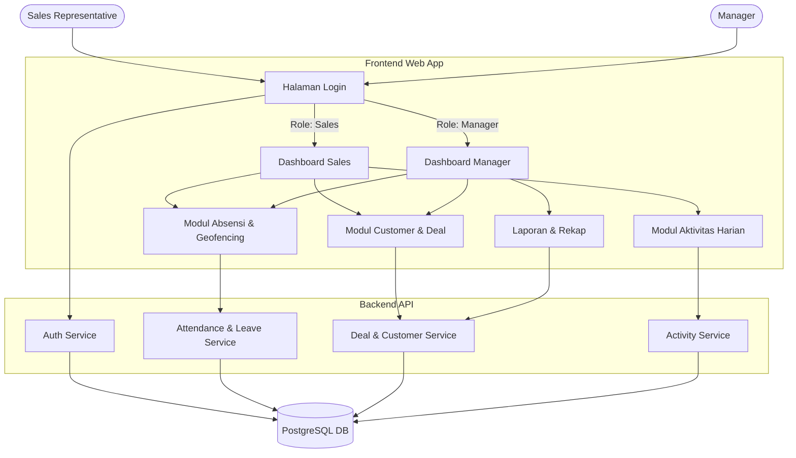

# Dokumentasi Analisis Sistem: Sales Track

Dokumen ini berisi hasil analisis terhadap sistem yang dibangun pada repositori proyek **Sales Track**. Aplikasi ini difokuskan pada pengelolaan aktivitas *sales*, pelacakan kehadiran berbasis geofencing, dan manajemen prospek / *deals*.

---

## 1. Arsitektur Sistem

Sistem dibangun menggunakan pendekatan arsitektur klien-server (Client-Server Architecture) di mana aplikasi dibagi menjadi dua modul utama di dalam sebuah monorepo (direktori `apps/`):

- **Frontend (`apps/web`)**
  - **Framework**: React.js dengan Vite (`type: module`).
  - **Styling**: Tailwind CSS dan PostCSS untuk pembuatan UI/UX yang modern dan responsif.
  - **Visualisasi Data**: `recharts` untuk membuat grafik/dashboard dan `xlsx` untuk ekspor laporan data.
  - **Autentikasi**: Terintegrasi dengan `better-auth` client.
  - **Routing**: `react-router-dom` untuk navigasi antar halaman (seperti navigasi Sales dan Manager).

- **Backend (`apps/api`)**
  - **Framework**: Node.js dengan Express.js dan TypeScript.
  - **Database & ORM**: PostgreSQL, dikelola menggunakan Drizzle ORM (terlihat pada `drizzle.config.ts` dan schema database).
  - **Autentikasi**: `better-auth` untuk otentikasi user.
  - **Storage**: Penggunaan `multer` untuk mengelola unggahan file (seperti foto check-in absensi dan dokumen aktivitas).
  - **Validasi Data**: `zod` untuk validasi input schema dari API.

- **Infrastruktur & Database**
  - **Docker Compose**: Digunakan untuk menyalakan instance database PostgreSQL 15 (`salestrack-db`) secara otomatis di environment lokal.

---

## 2. Modul & Fitur Utama

Berdasarkan analisis *database schema* dan *routes* yang ada, sistem ini mencakup beberapa modul kritikal:

### A. Manajemen Autentikasi dan Pengguna
- Dilengkapi dengan fitur login dan manajemen *session* menggunakan library Better-Auth.
- Terdapat role-based access control (RBAC): `sales`, `manager`, dan `admin`.

### B. Modul HR & Kehadiran (Attendance)
- **Check-in / Check-out**: Mencatat jam kehadiran *sales*.
- **Geofencing**: Mendeteksi lokasi user (Latitude/Longitude) dan membandingkannya dengan koordinat kantor (`office_settings`). Terdapat penanda jika user absen di luar radius yang diizinkan (`distance_from_office`, `is_outside_geofence`).
- **Pengajuan Cuti (Leave Request)**: Sales dapat mengajukan sakit, cuti, atau keperluan lengkap dengan unggahan dokumen, dan manager dapat melakukan penyetujuan (Approval).

### C. Modul CRM & Penjualan (Deals & Activities)
- **Data Customer**: Menyimpan data prospek/klien beserta kategorinya (Enterprise, SME, SaaS, dll).
- **Log Aktivitas**: Merekam aktivitas harian sales seperti visit, call, meeting, hingga demo produk. Log ini terikat dengan suatu deal dan pelanggan tertentu.
- **Manajemen Deal (Pipeline)**: Mengatur alur (stage) penjualan mulai dari Prospek, Negosiasi, Closing, hingga Lose. Terdapat pencatatan nilai proyek (`dealValue`).
- **Target Penjualan**: Pengaturan target bulanan / tahunan (`global_target`) untuk mengukur performa secara keseluruhan.

---

## 3. Struktur Database (Schema Utama)

Entitas utama dalam sistem dan relasinya:
- **`user`**: Data pengguna sistem. Memiliki relasi ke `session`, `account`, dan entitas lain sebagai aktor.
- **`customer`**: Pelanggan/klien perusahaan.
- **`attendance`**: Pencatatan data absensi harian berelasi langsung dengan `user`.
- **`leave_request`**: Pengajuan cuti yang terkait dengan `user`.
- **`deal`**: Mewakili peluang penjualan dengan nominal (*value*) dan tahapan (*stage*). Berelasi ke `user` (Sales) dan `customer`.
- **`activity`**: Aktivitas spesifik terkait `customer` dan/atau `deal`.
- **`office_settings` & `global_target`**: Tabel konfigurasi sistem yang bersifat tunggal atau global.

---

## 4. Flowchart Sistem (Mermaid Diagram)

### Diagram Alur Interaksi Pengguna dengan Sistem



### Flowchart Alur Kerja Sales di Lapangan

```mermaid
flowchart TD
    Start([Mulai Bekerja]) --> Login[Login ke Aplikasi]
    Login --> Dashboard[Lihat Target & Progress]
    Dashboard --> CheckIn[Lakukan Check-In]
    CheckIn --> GPS{Verifikasi GPS \n& Geofence?}
    
    GPS -- Dalam Radius --> HadirKantor[Status: Hadir Normal]
    GPS -- Luar Radius --> HadirLuar[Status: Hadir Luar Kantor \n Membutuhkan Foto/Alasan]
    
    HadirKantor --> AktPekerjaan[Mulai Aktivitas]
    HadirLuar --> AktPekerjaan
    
    AktPekerjaan --> PilihAktivitas{Pilih Aksi CRM}
    
    PilihAktivitas -- "Tambah/Ubah Deal" --> InputDeal[Input Data Deal \n(Nominal, Stage)]
    PilihAktivitas -- "Kunjungan/Call" --> InputAkt[Catat Hasil Meeting/Visit]
    PilihAktivitas -- "Tambah Klien" --> InputCust[Input Klien Baru]
    
    InputDeal --> Simpan[(Simpan ke Database)]
    InputAkt --> Simpan
    InputCust --> Simpan
    
    Simpan --> SelesaiAkt{Apakah Pekerjaan \nHari ini Selesai?}
    SelesaiAkt -- Belum --> AktPekerjaan
    SelesaiAkt -- Ya --> CheckOut[Lakukan Check-Out]
    
    CheckOut --> End([Selesai Bekerja])
```
